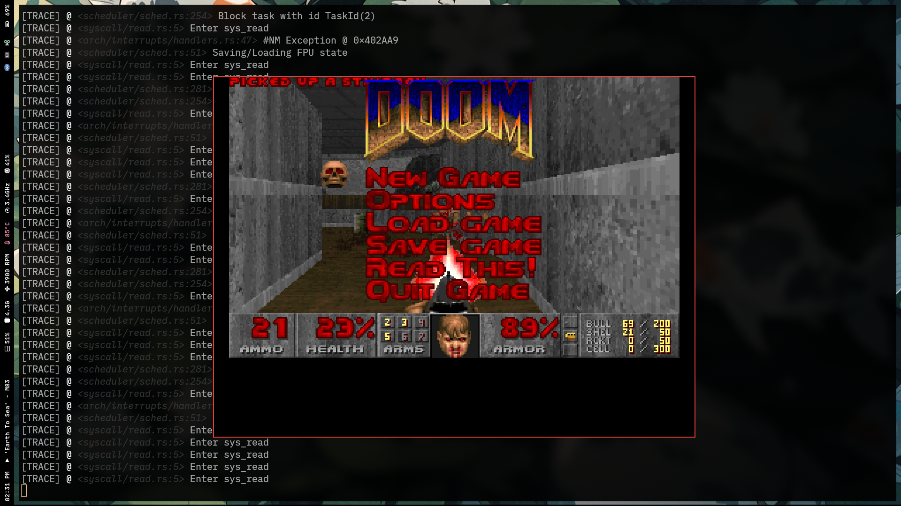

<div align="center">
  <h1>MagicalOS</h1>
  <p>A simple, modern, 64-bit operating system kernel crafted in rust 🦀</p>
  
  
  
  
</div>

---

**MagicalOS** is a from-scratch operating system kernel built in Rust (with a little bit of x86_64 assembly). It leverages Rust's safety and modern tooling to build foundational OS primitives. 

This project was built for the sake of learning how operating systems work under the hood and having fun bringing a machine to life!

## MagicalOS running doom:


## Current Features

What makes MagicalOS magical?
good question... even idk, but here's the progress so far xD

- ~~**Multiboot2 Booting**: Compatible with multiboot2, booted via an ISO image.~~
- **Limine Booting**: Switched to Limine bootloader for better features and easier setup.
- **Memory Management**: 
  - Physical memory tracking using a custom Bitmap Frame Allocator.
  - Global heap allocator which is a LinkedList Allocator (giving access to Rust's `alloc` crate, e.g. `Box`, `Arc`, `Vec`).
- **Hardware Integration**:
  - **APIC & IOAPIC**
- **Asynchronous Execution**: A simple asynchronous task executor.
- **Preemptive Multitasking**: OS Threads and a simple Robin Round Scheduler.
- **Synchronization Primitives**: Custom scheduler-aware Mutex and fair spinlock implementation.
- **Display & Logging**:
  - ~Custom VGA text buffer interface with color support~
  - VESA graphics with a flanterm for a modern terminal experience.
  - qemu logging to easily see kernel traces in the host terminal.
- **Userspace and Syscalls**: A simple syscall interface with a few implemented syscalls
- **File system**:
  - In memory Virtual File System (VFS)
- **ELF Loading**: The kernel can load and run ELF binaries, but still there is a lot of work that has to be done.

And oh, it can run doom!

## Getting Started

### Prerequisites

You need a Linux environment (or WSL2) with the following tools installed:

1. **Rust Nightly**: The kernel relies on unstable features (like `#![feature(allocator_api)]`) and custom target JSONs.
   ```bash
   rustup toolchain install nightly
   rustup default nightly
   rustup component add rust-src
   ```
2. **QEMU**: For emulating the x86_64 machine.
3. **xorriso**: To generate the bootable `.iso` file.

### Building and Running

Just clone the repository and run:

```bash
cargo x r
```

### Running tests

Kernel tests run inside QEMU (no host std test harness), and report through the debug console:

```bash
cargo x test
```

This command compiles the kernel test binary, builds a bootable ISO, launches QEMU headless,
and fails/succeeds based on the QEMU debug-exit code.

## TODOs:

I'm constantly trying to add magic, here's the rough roadmap of features I want to implement:

- [x] **Phase 1: Hardware Interrupts** (VGA, APIC, IOAPIC, Keyboard async tasks, Timer)
- [x] **Phase 2: Multitasking** (Context switching, Scheduler, Kernel threads)
- [x] **Phase 3: Storage** (VFS)
- [x] **Phase 4: User Space** (Syscalls, Processes, ELF loader)
- [x] **Phase 5: libc and Userland** (C library, Shell, Basic utilities)
    - [x] Port mlibc
- [x] **Run doom**

## Acknowledgements

- Learning from incredible resources and projects like the [OSDev Wiki](https://wiki.osdev.org/), [RedoxOS](https://gitlab.redox-os.org/redox-os/kernel), [eduOS](https://rwth-os.github.io/eduOS/), [Intel SDM](https://www.intel.com/content/www/us/en/developer/articles/technical/intel-sdm.html/) (probably not as incredible but this is all i have TT) and Philipp Oppermann's [Writing an OS in Rust](https://os.phil-opp.com/).
